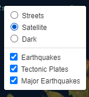
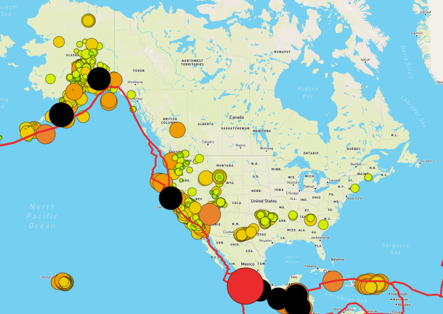
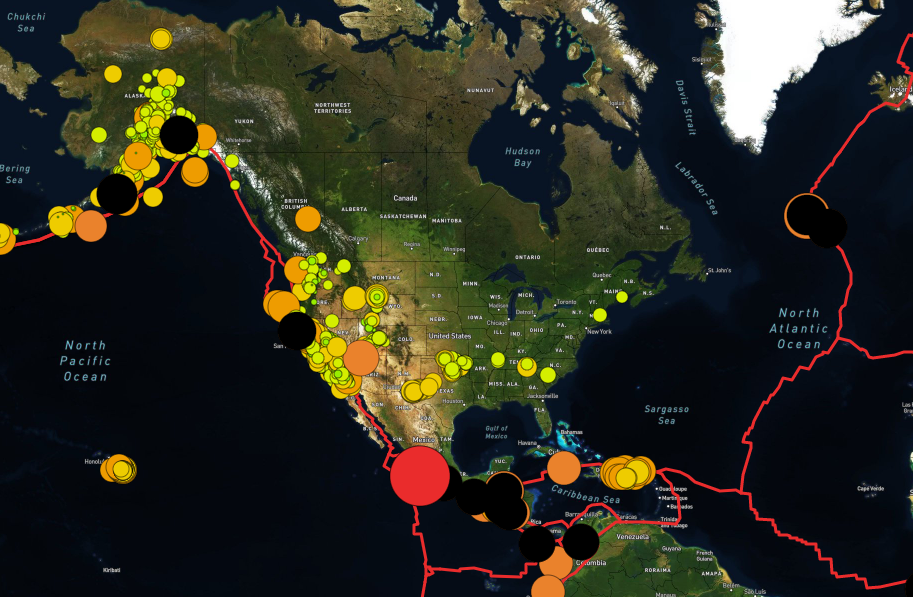
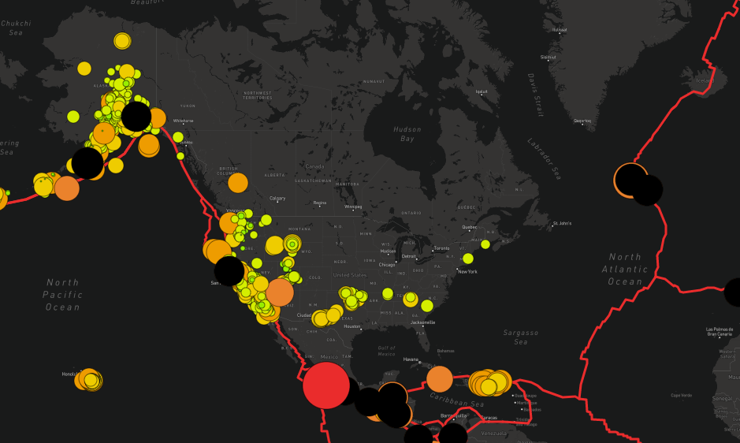

# Mapping_Earthquakes

https://hamzaali00.github.io/Mapping_Earthquakes/

Using JavaScript, Leaflet.js, and geoJSON data, I added tectonic plate data using d3.json(), added the data using the geoJSON() layer, set the tectonic plate LineString data to stand out on the map, and added the tectonic plate data to the overlay object with the earthquake data.

### Toggle

### Streets Map

### Satellite Map

### Dark Map

